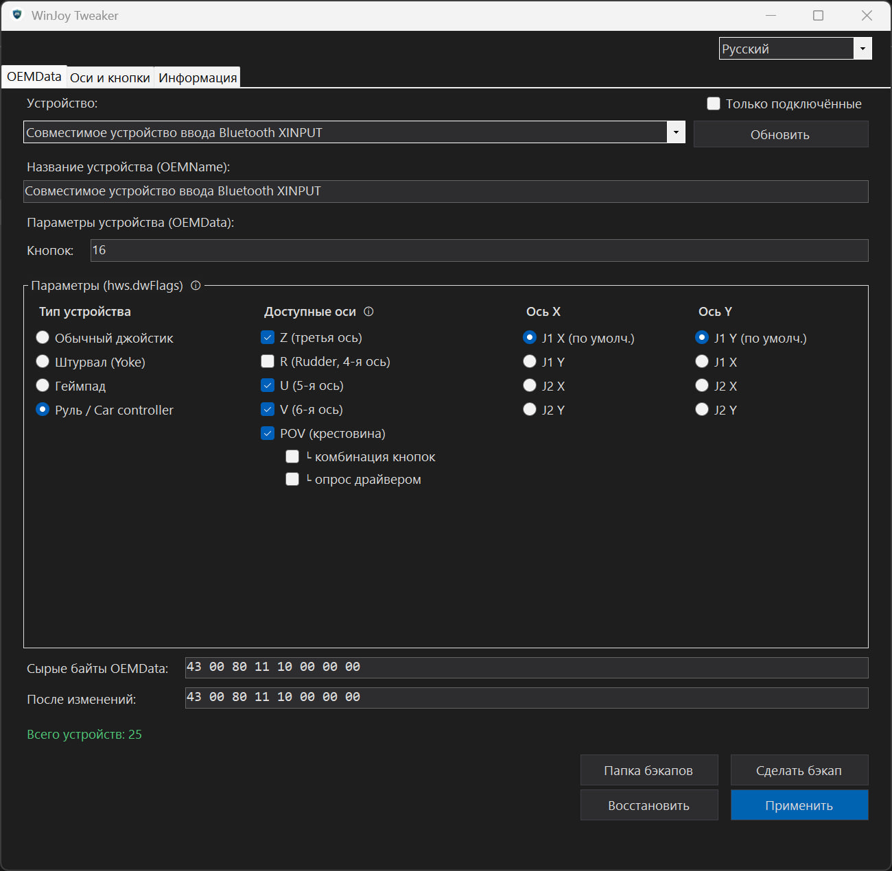

# 🎮 WinJoy-Tweaker


[](../../releases/latest)

🇷🇺 [Читать на русском](README.ru.md)

**WinJoy-Tweaker** is a lightweight system utility designed for the native configuration of game controllers (sim racing wheels, flight joysticks, Arduino-based DIY devices) at the Windows multimedia subsystem level.

It resolves compatibility issues between modern peripheral hardware and professional esports simulators (e.g., *Richard Burns Rally*, *Forza Horizon*) **without the use of background emulator software, guaranteeing Zero Input Lag**.

---

## ⚡ The Problem & The Solution

Many modern DirectInput controllers and custom DIY devices (based on SparkFun/Arduino) fail to be recognized properly by game engines due to non-standard axis mapping or missing Vendor/Product IDs in the games' hardcoded whitelists.

While using emulators (like x360ce or vJoy) solves the recognition issue, it introduces a virtual driver layer that adds input lag and can distort Force Feedback effects.

**The Solution:** WinJoy-Tweaker directly modifies the binary device profile (`OEMData`) within the Windows system registry. The OS natively and hardware-level translates the modified axes and system name to the game, completely eliminating any added latency.

---

## 🛠 Key Features

*   **Deep Axes Configuration:** Hide, add (Z, R, U, V, POV), and remap logical axes at the system level.
*   **Device Type Override:** Force Windows to recognize your device as a Car Controller, Flight Yoke, or standard Gamepad.
*   **DirectInput Parser:** The built-in `DeviceInspector` non-exclusively polls the controller to display Force Feedback support, dead zones, and axis granularity.
*   **Fail-Safe Backups (Safety Manager):** The utility does not require Administrator privileges (operates entirely within `HKEY_CURRENT_USER`). Before any operation, it generates a native `.reg` file for a safe rollback to previous or factory settings.
*   **Renaming Capabilities:** Modify the system device name (`OEMName`) and rename logical axes/buttons for the `joy.cpl` control panel.
*   **UI/UX:** An intuitive Graphical User Interface featuring a custom Dark Theme and dynamic on-the-fly localization (EN/RU).

---

## 📸 Screenshot

|
|:---:
| *Basic flags configuration and axis mapping* |

---

## ⚙️ Under the Hood

The project is implemented in **C++** utilizing a hybrid architecture:
*   **Unmanaged C++:** Handles the core registry logic (`Advapi32.lib`) and `IDirectInput8W`. Deserialization of the `REG_BINARY` array is achieved by projecting the buffer onto the `JOYREGHWCONFIG` structure (based on the legacy DDK `mmddk.h` specifications). It also features a custom lexer and `.reg` file generator supporting UTF-16 LE, BOM, and Little-Endian hex strings.
*   **Managed C++ (C++/CLI):** Used exclusively to render the GUI (Windows Forms) and intercept system messages (e.g., hooking `WM_PAINT` for custom flat UI components).

## Installation

Two options — grab a prebuilt release, or build it yourself.

### Option 1: prebuilt release

1. Download the latest `WinJoyTweaker.exe` from the [Releases](../../releases) tab.
2. No installation needed — it's portable, just run the exe.

### Option 2: build from source

You'll need **Visual Studio 2022** (or newer) with these workloads:
*   Desktop development with C++
*   C++/CLI support for v143 build tools
*   Windows 10/11 SDK

Then:

```bash
git clone https://github.com/Andrey22250/WinJoy-Tweaker.git
```

Open `WinJoy-tweaker.sln` and build in the `Release | x64` configuration. The resulting `WinJoyTweaker.exe` will be in `x64/Release`.

## How to Use

1. Run `WinJoyTweaker.exe`.
2. Select your controller from the dropdown list — connected devices are detected automatically.
3. Apply the desired modifications (change the Name, Axes, or Device Type).
4. Click **"Apply"**. The program automatically backs up your current state first.
5. Physically unplug and re-plug your controller's USB cable (or disable/enable the device) so Windows Plug-and-Play reloads the updated registry keys.
6. To revert changes, click **"Restore"** and select the generated `.reg` file from the backups folder.

## ⚠️ Disclaimer

This program modifies the system registry (strictly within the `HKCU` hive). Despite the automatic backup mechanism, the author is not responsible for any peripheral malfunctions. In the event of a critical failure, simply remove your device via the Windows "Device Manager" and reconnect it to force Windows to rebuild the factory registry keys (Clean State).

---
**Developed as part of a Bachelor's Thesis in Software Engineering.**  
*Polzunov Altai State Technical University, 2026.*
